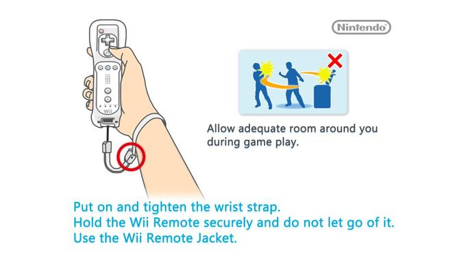
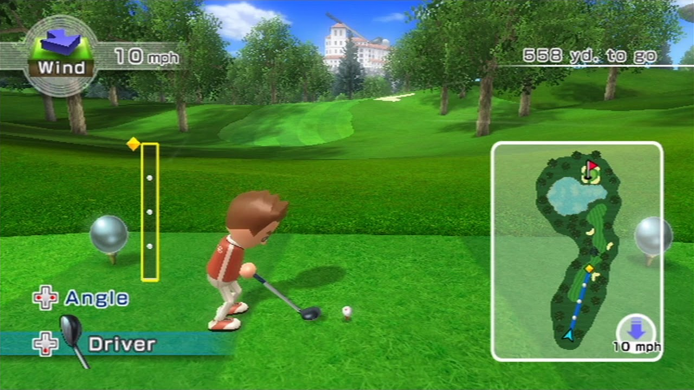
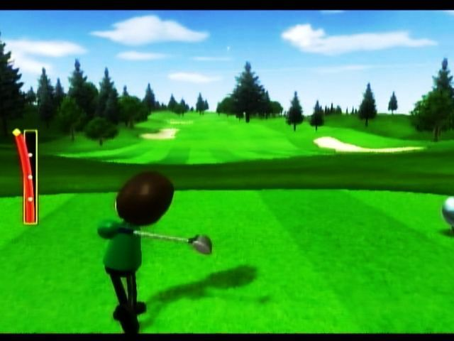
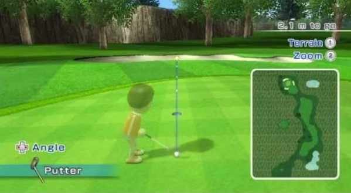
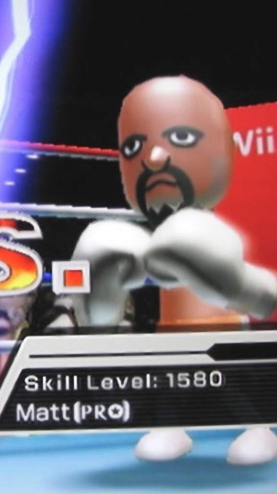

<!DOCTYPE html><html><head><meta charset="utf-8">README.md</head><body id="preview">
<h1 class="code-line" data-line-start=0 data-line-end=1>Wii Golf Instructions</h1>

Are you interested in golf but all other lessons have failed you? Golf can be difficult, laborious and more trouble than it’s worth. The perfect alternative is Wii Golf, which offers all of golfs greatest joys in the comfort of your own home!

<h1 class="code-line" data-line-start=4 data-line-end=5>Objective</h1>

To learn how to play Wii Golf and be able to compete with the best non-player characters in the game.

<h1 class="code-line" data-line-start=8 data-line-end=9>Required Items</h1>
<ul>
<li class="has-line-data" data-line-start="10" data-line-end="11">Wii</li>
<li class="has-line-data" data-line-start="11" data-line-end="12">Wii controller</li>
<li class="has-line-data" data-line-start="12" data-line-end="14">Wii Sports game</li>
</ul>
<h1 class="code-line" data-line-start=14 data-line-end=15>Instructions</h1>
<h2 class="code-line" data-line-start=16 data-line-end=17>Step 1: Game Set Up:</h2>
<ul>
<li class="has-line-data" data-line-start="17" data-line-end="18">You must connect your Wii console to a television.</li>
<li class="has-line-data" data-line-start="18" data-line-end="20">Put in your wii sports disc and turn on the console.</li>
</ul>
<h2 class="code-line" data-line-start=20 data-line-end=21>Step 2: Controller Set Up:</h2>
<ul>
<li class="has-line-data" data-line-start="21" data-line-end="22">Place the controller on a flat surface when asked to do so to allow the controller to calibrate.</li>
<li class="has-line-data" data-line-start="22" data-line-end="23">Next place the controller’s safety strap around your wrist and tighten until snug.</li>
<li class="has-line-data" data-line-start="23" data-line-end="25"> <b>Important Disclaimer:</b> Failure to utilize the safety strap can result in the controller being errantly thrown. This poses a risk to yourself and all nearby objects and persons.</li>
    
 
 
    

</ul>
<h2 class="code-line" data-line-start=25 data-line-end=26>Step 3: Game Selection:</h2>
<ul>
<li class="has-line-data" data-line-start="26" data-line-end="27">Wii Sports offers a variety of games. When you reach the main menu you will want to navigate to the golf section, which can be found at the second box from the bottom.</li>
<li class="has-line-data" data-line-start="27" data-line-end="29">Point the controller at this box and press A.</li>
</ul>
<h2 class="code-line" data-line-start=29 data-line-end=30>Step 4: Mii Selection:</h2>
<ul>
<li class="has-line-data" data-line-start="30" data-line-end="31">Now is the time to select your personally customized Mii.</li>
<li class="has-line-data" data-line-start="31" data-line-end="33">Don’t have a mii? Don’t worry! You can choose from a selection of premade characters that made by Nintendo.</li>
</ul>
<h2 class="code-line" data-line-start=33 data-line-end=34>Step 5: Pick a Club:</h2>
<ul>
<li class="has-line-data" data-line-start="34" data-line-end="35">Since this is your first shot, the driver, Hybrid, or low number Iron will most likely work best.</li>
<li class="has-line-data" data-line-start="35" data-line-end="37">When is a club is selected, you can see how far that club can reach on your minimap in the top left corner. Feel switch between clubs until you find the one best suited for the shot.</li>

 
 
    

    </ul>
<h2 class="code-line" data-line-start=37 data-line-end=38>Step 6: Power and Direction:</h2>
<ul>
<li class="has-line-data" data-line-start="38" data-line-end="39">Move the pointer using the D-pad to point it at the hole. Take note of any wind that (indicated in the top right corner) and adjust accordingly.</li>
<li class="has-line-data" data-line-start="39" data-line-end="40">The bar on the minimap correllates with the power bar during a swing. A full swing that fills up the bar will go the full distance displayed on the map. Similarly a half power swing will go half that distance.</li>
<li class="has-line-data" data-line-start="40" data-line-end="42"> <b>Note:</b> Going over the bar on power will result in an errant hit. This will cause the ball to veer off of the intended course.</li>
</ul>
    
 
 
    

<h2 class="code-line" data-line-start=42 data-line-end=43>Step 7: Swing Time:</h2>
<ul>
<li class="has-line-data" data-line-start="43" data-line-end="44">Take a couple practice swings and adjust to how the speed of the swing affects the power. Make sure your swing is smooth and consistent the whole way through.</li>
<li class="has-line-data" data-line-start="44" data-line-end="46">Press and hold the B button on the controller to move up to the ball. This is no longer practice, your next swing is the real deal.</li>
</ul>
<h2 class="code-line" data-line-start=46 data-line-end=47>Step 8: Getting To the Green:</h2>
<ul>
<li class="has-line-data" data-line-start="47" data-line-end="48"><b>Note: </b>You may reach the green on your first shot. If this is the case skip to step 9.</li>
<li class="has-line-data" data-line-start="48" data-line-end="50">Reaching the green may require additional shots. Check the clubs reconmended to you by Nintendo and choose the one that will help you get to the putting green. Take some practice swings and let it fly!</li>
</ul>
<h2 class="code-line" data-line-start=50 data-line-end=51>Step 9: The Putt:</h2>
<ul>
<li class="has-line-data" data-line-start="51" data-line-end="52">Line up the shot taking the shape of the green into account.</li>
<li class="has-line-data" data-line-start="52" data-line-end="53">Be careful not to use too much power or the ball may hit the hole and fly out.</li>
<li class="has-line-data" data-line-start="53" data-line-end="55"><b>Helpful Hint</b> If your are very close to the hole any power but the lowest will strike the ball too hard. Gently flick your wrist to achieve a swing with the minimum power.</li>

 
 
    

    </ul>
<h2 class="code-line" data-line-start=55 data-line-end=56>Step 10: Improvise, Adapt, Overcome:</h2>
<ul>
<li class="has-line-data" data-line-start="56" data-line-end="57">Move on to the next hole and repeat steps 5-9 over.</li>
<li class="has-line-data" data-line-start="57" data-line-end="58">Continue practicing and soon you will be ready to face even the toughest opponents.</li>
<li class="has-line-data" data-line-start="58" data-line-end="59">Search for little easter eggs on maps that could allow you to reach the hole in less strokes.</li>
<li class="has-line-data" data-line-start="59" data-line-end="60">Continue playing until your mom tells you that dinner is ready.</li>

 
 
    

    </ul>
</body></html>
